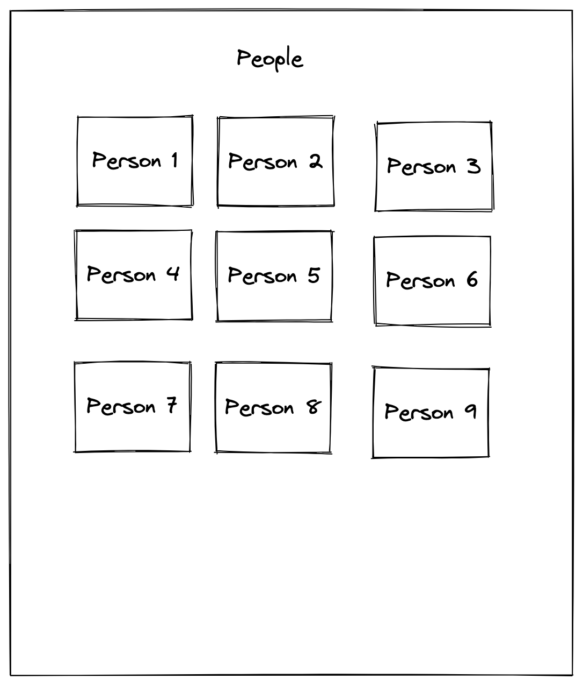
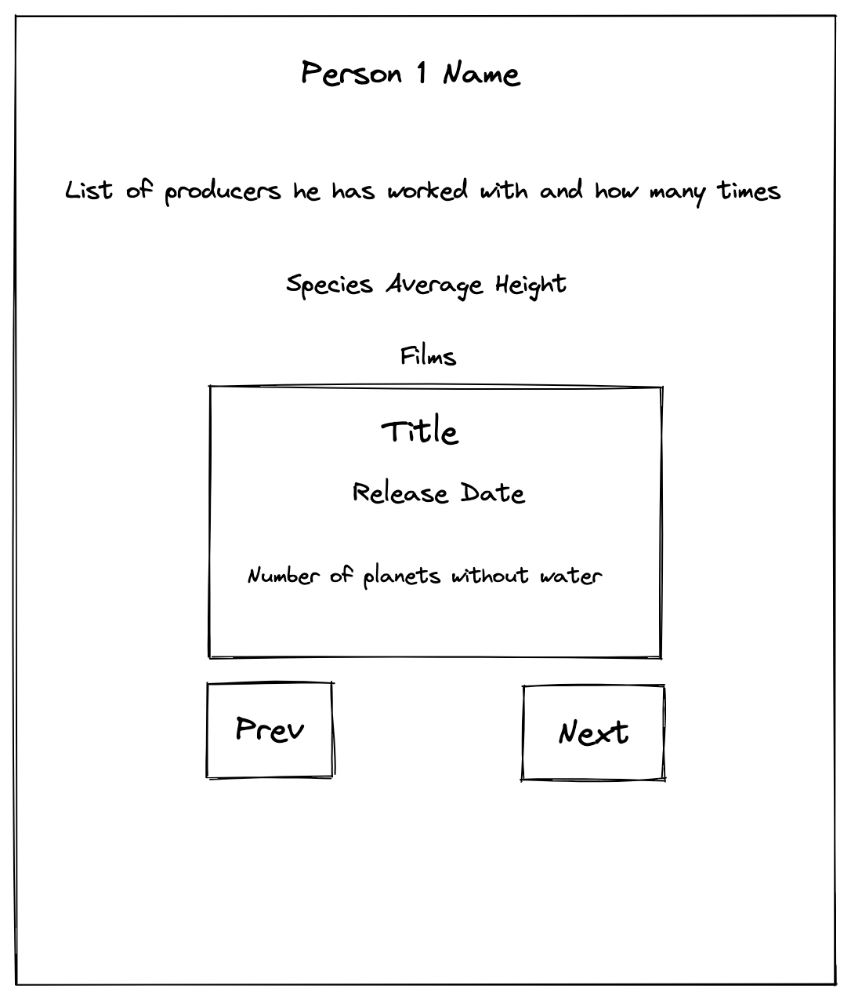

# Code Test

## Assignment

The application is setup with React Router containing two routes. The goal of
the assignement is to create these two pages based on the mockups mentioned in
each page section.

The data is fetched from
[Star Wars API](https://studio.apollographql.com/public/star-wars-swapi/home?variant=current)
with the already setup [urql](https://formidable.com/open-source/urql/) client.

For the styling method I have decided to use tailwind, because allow us to build UIs quickly without
having to write any css. We can just apply styles directly to our HTML. Apart from that, we can reduce
the CSS file leading to faster page load times.

- `/` - the home page
- `/person/:personId` - the person page

### Home page

This page lists all the people from the Star Wars API. Each person is linked to its own page.



### Person page

This page contains overview of the player

- List of producers the person has worked with and how many times.
- Birth year
- Person species average height.
- Paginated list of person films containing:
  - Title.
  - Release Date.
  - Number of planets without water in the film.



## Setup

Install dependencies (using NPM)

```bash
$ npm run install
```

Download GraphQL Schema

```bash
$ npm run download-schema
```

Generate GraphQL Types (generated types will be in `src/generated/graphql.ts`

```bash
$ npm run codegen
```

Start dev mode

```bash
$ npm run dev
```

Execute `Prettier` to format our code to follow a set of rules or conventions

```bash
$ npm run format
```

Execute `Lint` with [ESLint](https://eslint.org/)

```bash
$ npm run format
```
